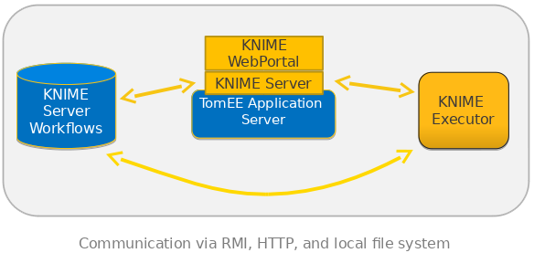
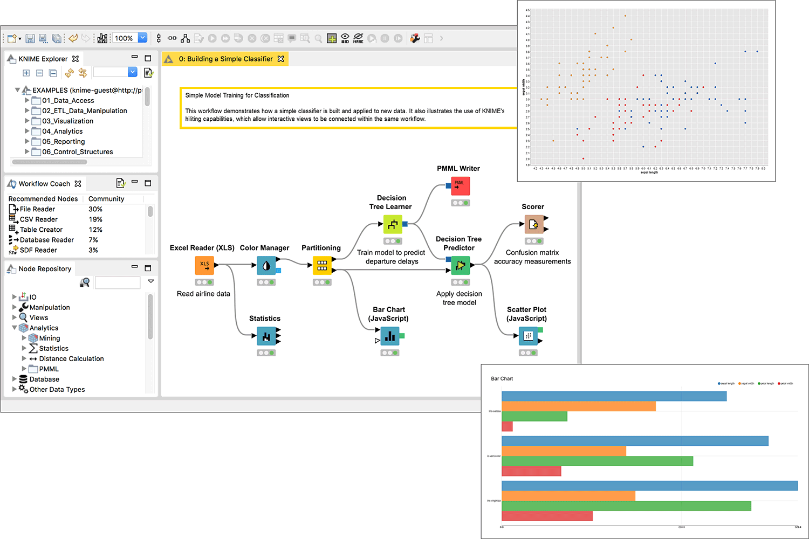

# Guided Analytics Using Knime :wave: fa18-523-52

| Anna Heine
| avheine@iu.edu
| Indiana University 
| hid: fa18-523-52
| git: [:cloud:](https://github.com/cloudmesh-community/fa18-523-52/blob/master/paper/paper.md)

:o: lots of refernce missing. you need to use bibtex in paper.bib and use them here. you can reuse any bib from any student or the technology handbook

:o: maybe the architecture diagram would help. I am not sure I understand what thsi technology is about from this description

:o: no mentioning of the workflow hub

:o: no mentioning of integration with azure, aws

:o: I propose to merege abstracts and conclusion in regular text to make this a chapter so we can put it in the handbook

---
Keywords: KNIME, workflow, workbench
---

## Abstract

KNIME [@fa18-523-52-KNIME] stands for KoNstanz Information MinEr and is an open source data 
analytics software that creates services and applications for data science projects. KNIME 
allows its users to create visual workflows with a user-friendly drag and drop graphical interface 
that depletes the need for any programming. However, KNIME does allow implementation of other
scripting languages such as Python [@fa18-523-52-KNIME]  or R [@fa18-523-52-KNIME] that
creates connections to abilities within Apache Spark or other machine learning tools. KNIME 
allows imports of datasets from a variety of formats, some of which include CSV [@fa18-523-52-machine] ,
PDF [@fa18-523-52-machine] , JSON [@fa18-523-52-JSON] and more. It also supports several 
unstructured data types from images, documents, and certain networks. KNIME operates by a node
system that includes embedded modules that help its users build their workflow. With this node 
system, users can make changes at every step of their analysis to ensure the most current 
version. KNIME also provides detailed visualizations from a set of defined graphs 
and charts which can lead to predictive analyses and machine learning 
implementations. Users can shape their data by a variety of mathematical models 
such as statistical tests, standard deviations, and means. Users can even select 
specific features for use in possible machine learning datasets and apply filters 
to mark out some of the data if needed. KNIME can be exported in many formats such
as PDF, CSV and more. 

## Introduction

KNIME is a platform that can perform intense data analytics on a graphical user 
interface and incorporate a user-friendly workflow. It incorporates large or small
data sets and even projects as broad as deep learning. KNIME is diverse in that its
users do not necessarily need to know any coding languages to use it. KNIME is a 
process-oriented, single base workflow with basic input/output manipulations. KNIME 
is an open source platform that uses thousands of its documented nodes within the 
node repository for use in the KNIME workbench. A node is a single processing point 
of data manipulations within your workflow. A workflow is described as a sequence of 
steps a user follows in their platform that is used to complete their final product.
The collection of nodes that creates a KNIME workbench is able to be executed locally
or within the KNIME web portal on its own server. The workflow that KNIME follows 
first begins with data collection, data cleaning, data integration, and finally, 
feature extraction. This workflow allows for large files such as a CSV to be accessed
through the web portal and it can therefore be manipulated through several wizards
[@fa18-523-52-guided]. 

## KNIME Used in Big Data

KNIME is useful in Big Data applications because it aids in the process of guided 
analytics. Guided analytics is a process that functions by providing automation to 
data science projects. This usage brings to light some of the features of big data 
that are sometimes hidden when visualization tools are unused. Depending on the wizard
the user selects, the data can then be viewed in a formatted table using forward 
feature selection methods. This means that the user can then select their data based 
on the most accurate correlating information. This will, of course, be varied based on
the type of information that is entered into the table. The next step in the 
data-selection process is a second screen with a wizard that asks the user to choose a
target variable. The next screen will then show to offer a selection of algorithms 
which the user can use to entrain the dataset. After choosing an algorithm, the user
may browse from a list of displayed visualizations that include their dataset such as 
bar graphs, an ROC curve, and more. The user can then download their data model in a 
PMML format, which is universally configurable in any enterprise application. The 
steps to download and set up your KNIME platform is quite simple. First, go to the 
KNIME website and obtain the download. Then, install KNIME and set its working directory
for KNIME to store its files in. To set up a KNIME workflow, go to the File menu on the
platform and choose New. Give your workflow a name and then click Finish. This process
establishes a basic, empty workflow in which users can drag nodes from the repositories 
on the left-hand side into the workflow space. To increase user collaboration and support, 
KNIME also includes a Workflow Hub [@fa18-523-52-hub]. This hub allows users to share their 
workflows and make comments or suggest improvements to their designs. The components of a 
KNIME server after installation are hosted on the same machine. The components include:
a workflow repository, the executor, the server. +@fig:diagram shows the simple architecture
of KNIME's server for a single user. +@fig:architecture shows the basic KNIME platform setup 
with graphs, repositories, and the workbench. 

{#fig:diagram}

{#fig:architecture}

An example of big data analysis hosted by KNIME is a store trying to compare its products
sold over multiple store locations. The first step in the visualization process would be 
to import your data. Within the workflow, users can view differences or find a possible 
correlation in their dataset by searching for linear correlation in the repository. After 
choosing this feature, the user must connect the data set to the linear correlation node 
via a line on the workflow grid. The execute option can then be chosen to view the 
correlation matrix. The user can hover over a specific cell to select the feature you want
to use for further prediction. The next few steps are used in visualization and analysis 
of user data. Under the Views tab, the user can search for different graphs or plots. A 
scatter plot, in this case, would be a great way to visualize data from multiple items 
within a store. You then must drag and drop it and connect it within the workflow like 
before. You can then configure just how many rows that you would like to look at.
+@fig:kmeans shows an example of user analysis by the drag and drop method.

{#fig:kmeans}

KNIME also includes nodes that can show missing values from certain datasets. KNIME 
includes a special node in which users may find imputations in their dataset. This is 
displayed as Missing Values in the output portal. From here, you can choose from a variety
of options that allow handling of these imputations. For example, with strings you can move
forward and backwards in between rows, create a custom row, or remove a row. You can also 
manipulate numerical data values by performing several mathematical functions. The basic
limitations for KNIME include visualizations that are not extremely neat or detailed as 
other software. The software's updates sometimes cause user issue and result in necessary 
re-installation. As this is not as popular of a program as Python or other editing 
platforms, the community does not have as rich of a support system, therefore, users 
sometimes struggle with researching issues. 

KNIME has the ability to be integrated with other techonlogies for larger open-source 
projects. These cloud services allow for user's projects to be analyzed even further. 
For example, KNIME can be used with Amazon AWS [@fa18-523-52-aws] and 
Azure [@fa18-523-52-azure]. KNIME's platform can be hosted on Microsoft Azure Cloud 
Services. Azure allows KNIME to perform its analytical, machine learning, and deep 
learning tasks on its integrated server. This application can be downloaded from Azure's 
Marketplace. KNIME can also be incorporated with Amazon AWS. When KNIME is connected to 
AWS resources, users can leverage the memory available while connected to the relational 
database service to construct SQL queries visually. 

## Conclusion

KNIME is a data analysis software platform that allows for easy read and manipulation of 
large datasets that can ultimately be used to make inferences and predictions. Its 
user-friendly interface allows for a broad integration of users and sometimes more efficient
workflows. KNIME has several applications for its users such as data modeling, 
machine learning, predictive analysis, and more. After visualization, users can extract 
specific features from their data and implement it into a model of their choice, which can
then be exported as a CSV file. 

